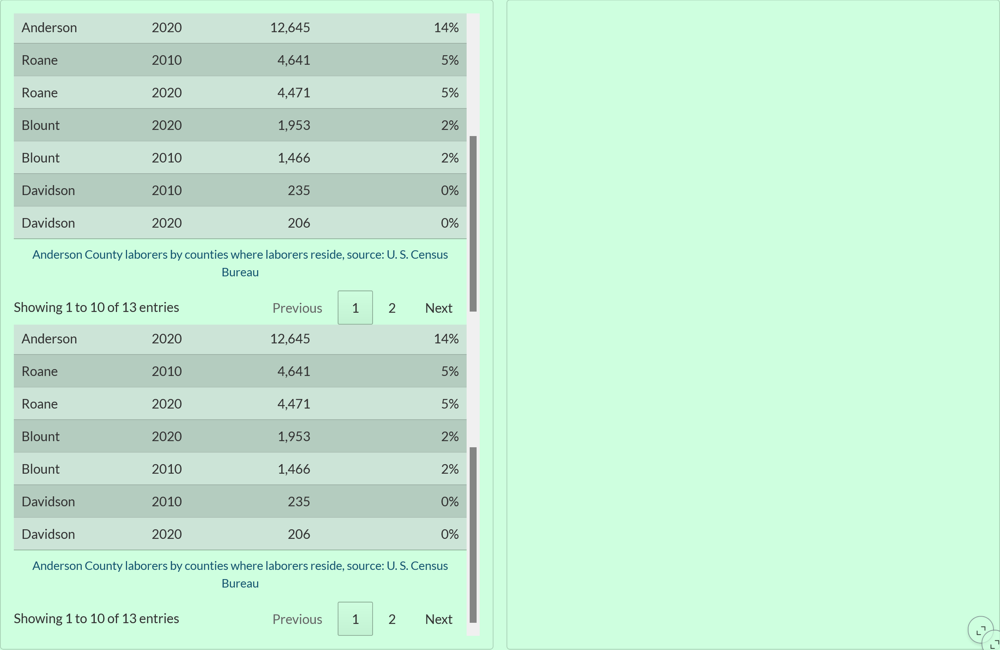
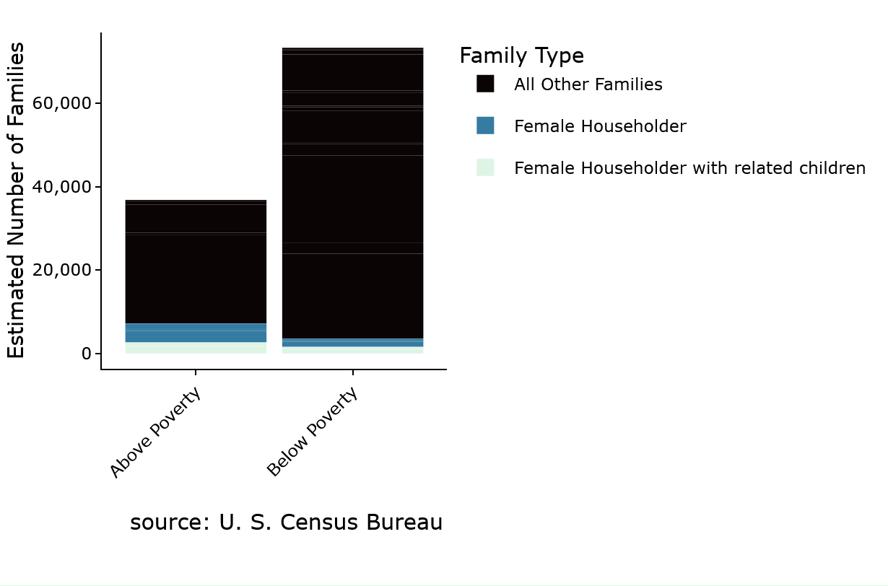
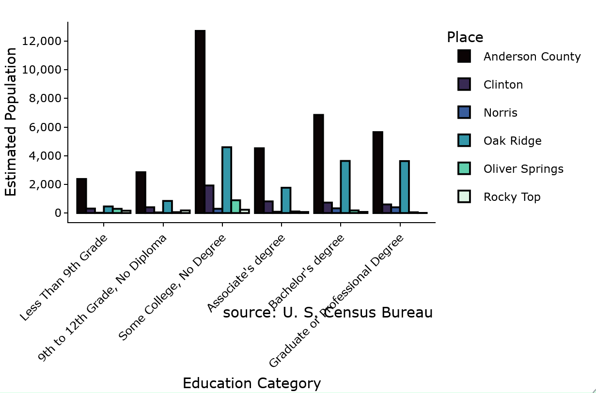
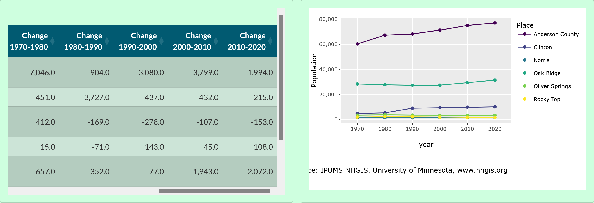

# Issues with Dashboard and Solution:

This is meant to serve as a description of issues and solutions for potential future use (e.g. if we make another dashboard, if some of the problems get fixed upstream and it breaks our band-aids, if someone comes across this repo while trying to fix their issues).


## Accessibility

Most of these were found by using axe-core in the project

### Missing a "main" section
https://www.w3.org/WAI/ARIA/apg/patterns/landmarks/examples/main.html

Quarto only recently started working on fixing some of their a11y problems- they've got a decent number of issues on GitHub to address them, but in the mean time we needed to add a <main></main> section for our content so people who use screenreaders or use their keyboard to navigate can more easily navigate. To fix it, in "countyDashboard.qmd" (which gets made into the reports) before any content there's 

```{=html}
<main>
```
and after all of the content there's

```{=html}
<main>
```

The {=html} tells quarto to put that code in the html itself, and this adds the main tag that is required.

### Two <Header> sections
https://dequeuniversity.com/rules/axe/4.1/landmark-no-duplicate-banner
and
https://www.accessibilitychecker.org/ace/engine/ace-landmark-unique-label/

There should only be one <header> tag, and labels should be unique. When doing a website project with a dashboard in quarto, both the website nav bar and dashboard nav bar are marked as "header", and the nav bars don't have unique aria labels so people who use assistive technologies might have a difficult time getting to the one they want. This is fixed in the "postRender.py" script by using beautiful soup (https://beautiful-soup-4.readthedocs.io/en/latest/) to navigate and edit the html. This might break if the ID's on the thing change- if that happens, first check if quarto has fixed this issue upstream (https://github.com/quarto-dev/quarto-cli/issues/14375), and if not use bs4 to look for everything marked as 'nav' and then figure out which should be the dashboard vs website header.

```{python}
def replaceExtraHeadersWithDiv(soup):
  for i, header in enumerate(soup.body.find_all('header')):
    if i != 0:
      header.name="div"

def addAriaToHeaderNavs(soup):
  for nav in soup.body.find_all('nav'):
    if nav.parent.get('id') == 'quarto-dashboard-header':
      nav['aria-label']="dashboard header"
    elif nav.parent.get('id')=='quarto-header':
      nav['aria-label']="website header"
```


## Issues with rendering

### Inconsistently missing plotly plots

 

For some reason, sometimes Quarto repeats IDs for plotly plots. Because they are built in javascript, having the IDs repeated prevents them from displaying correctly. Sometimes this can be fixed by editing code, but for a quick(ish) fix I've just forced the IDs to be unique in the postRender.py script. One difficulty of this is that the data for each plot is stored in a separate script, so I couldn't just edit the repeated ones easily (e.g. look for any repeats and then add something like id = str(id) + str(i)) because I'd run the risk of messing up where the script is connected to [note: when fixing things, account for the likelihood you'll break them more either now or later].

```{py}
def makePlotlyIdsUnique(soup):
  for i, plotlyPlot in enumerate(soup.find_all(class_='plotly')):
    originalId=plotlyPlot.get('id')
    plotlyPlot['id']="plotlyPlot"+str(i)
    plotlyPlot.parent.find(attrs={"data-for": originalId})['data-for']="plotlyPlot"+str(i)
```

### Rapidly and randomly resizing plotly plots

The recordings are not included here due to the fact that things are moving rapdily. Go see the "resizingPlotly" files in issuesPics if you want to understand what the problem looked like.

The solution was to just add a thing to the postRender.py to take the style (the css) for each plot and only edit the height so it was consistently 100%. By default plotly has the width and height set to 'auto', and as far as I can tell you're supposed to provide a size in pixels, which would cause issues with trying to (later) make this dashboard properly responsive.

```{py}
def adjustPlotlySize(soup):
  for plotlyPlot in soup.find_all(class_='plotly'):
    plotlyPlot['style']=re.sub(r'height:\d+px','height:100%',plotlyPlot['style'])
```

## Issues with plots

### Improperly grouped data



For the Poverty Status by Family Type, I made a stacked bar chart where each color was the family type. Unfortunately, I didn't think to consider the Place variable (e.g. Anderson County vs Oak Ridge), and it took me a while to figure out what I did wrong. Currently the two expected solutions will be to limit it to per county data (instead of including data for each municipality), or switching to two plots next to each other.

### Issues with Captions/Labels





The first issue I ran into (and forgot to take a picture of) was overlapping x-tick captions for many graphs. There was not enough horizontal space for e.g. all of the municipalities in Anderson to fit below a given graph, and my usual fix of just having the labels alternate being higher or lower isn't supported by ggplotly. I ended up just tilting all of the text by 45 degrees, and while this introduced a potential issue re: the amount of verticle space required and a real issue of overlapping captions, it fixed the first issue.

The second issue was that ggplotly doesn't always work with ggplot captions, so I created a function to add normal plotly captions. This introduced the issue seen in the first figure in this section, where they were often over lapping with the x axis labels. Because this is designed to make one base report and then use that for all of the counties, having to determine an appropriate number to adjust the caption by would be difficult and made even more difficult by the fact that I don't know ahead of time the size of the graph. To fix this, I saw someone on StackOverflow do something like 

```{r}
plotly::ggplotly(
ggplot([...])+
labs(x="X axis label<br>Caption")
)
```
Because it is plotly and is desiged to work with html, you should use `<br>` [html for a line break https://www.w3schools.com/TAGS/tag_br.asp] instead of "\n" [A more common new line character in programming in most programming languages e.g. https://stackoverflow.com/questions/19008970/java-what-does-n-mean]

For the text running off of the screen, switching to a smaller but still readable font size fixed the problem.

## Misc

### Issues with file formatting

Set encoding to "utf-8" when opening files in Python, esp ones that include characters that might not be unicode (e.g. "é" could be formatted as unicode or as utf-8, and it's difficult to know from looking at it).

### Citations with .bib and .csl in plots

https://quarto.org/docs/authoring/citations.html

Quarto allows you to do @CitationRef to use citations from a .bib bibliography, and format it with a .csl. You can use https://www.zotero.org/styles to find and download the csl for whatever style you want, and you can use their online citation maker https://zbib.org/ with the format set as "BibTeX generic citation style" and then copy it into your file. I prefer to do things this way to try to maximize consistency, minimize the risk of pebkac (https://en.wikipedia.org/wiki/User_error#PEBKAC/POBCAK/PICNIC), and make it easier to switch citation style if needed. However, you cannot use @CitationRef in a ggplot and get the citation to appear because of how Quarto renders things. 
It is important to be aware of the bus problem (https://en.wikipedia.org/wiki/Bus_factor) when adding complexity that is incredibly useful for the person adding it, but potentially opaque to others. Additionally, my current understanding of the NHGIS guide to citations is that because this is an online thing and not e.g. a research paper, they prefer a specific citation style, so we can't use a csl for them. So, to balance that there's an r script (citations.R) that contains variables with each citation, and those citations can be used in the plots by using the variables. Those can be manually updated in the future if needed. 
Currently, there's a step in the preRender.py that creates a Quarto Mark Down file with a header with the reference name and below that the @Citation format of the reference, renders that format so quarto will create the needed .html file with the citations, then uses beautiful soup to navigate the html to create a dictionary of each reference with it's citation, and then writes that dictionary to the citations.R script in the format required. I did also include vars for paths because I think those might change in the future. I'll probably move this over to the "common_shared_assets" later bc it'd make more sense for it to live in that repo, but I think this should work fine for now.

```{py}
def makeCitationQmd(pathToReferences,folderWhereCitations):
  with open(pathToReferences,'r', encoding='utf-8') as f:
    tmp=re.findall(r'@\w*{\w*',f.read())
    dictOfCites={}
    for citation in tmp:
      citationStr=re.sub(r'\w*{','',citation)
      dictOfCites[re.sub(r'@','',citationStr)]=citationStr
  with open(os.path.join(os.getcwd(),folderWhereCitations,"citations.qmd"),'w', encoding='utf-8') as f:
    strToWrite='---\ntitle: \"Citations\"\nformat: html\ncsl: ../common_shared_assets/citations/chicago-notes-bibliography-access-dates.csl\nbibliography: ../common_shared_assets/citations/references.bib\n---\n\n'
    for citation in dictOfCites.keys():
      strToWrite=strToWrite+"# " + str(citation) + "\n\n" + dictOfCites.get(citation) + "\n\n"
    f.write(strToWrite)
  subprocess.run(["quarto","render", os.path.join(folderWhereCitations,"citations.qmd"), "-o", "citations.html"], stdout=subprocess.PIPE,stderr=subprocess.STDOUT, stdin=subprocess.DEVNULL) 
  if os.path.isfile(os.path.join(folderWhereCitations,'citations.html')):
    os.remove(os.path.join(folderWhereCitations,'citations.html'))
  os.rename("citations.html", os.path.join(folderWhereCitations,'citations.html'))
  
    
def getDictOfCitations(folderWhereCitations):
  with open(os.path.join(folderWhereCitations,'citations.html'),'r',encoding='utf-8') as f:
    soup=BeautifulSoup(f, features="html.parser")
  dicOfCites={}
  for p in soup.body.find_all('p'):
    if p.parent.find('h1') is not None:
      ref="@"+p.parent.find('h1').text
      cite=re.sub(r'\d+$','',p.text)
      dicOfCites[ref]=cite
  return(dicOfCites)

def updateCitations(fileName,dicOfCites):
  with open(fileName,'w',encoding='utf-8') as f:
    text=f.read()
    for key in dicOfCites.keys():
      text=re.sub(key,dicOfCites.get('key'),text)
    f.seek(0,0)
    f.write(text)
    f.truncate() #to remove spare spaces, recommended by Stack Overflow
    # Source - https://stackoverflow.com/a/68184578
    # Posted by Booboo, modified by community. See post 'Timeline' for change history
    # Retrieved 2026-07-08, License - CC BY-SA 4.0

# [...]

pathToReferences=os.path.join("common_shared_assets","citations","references.bib")
folderWhereCitations="resources"

# [...]
 
makeCitationQmd(pathToReferences,folderWhereCitations)
dicOfCites=getDictOfCitations(folderWhereCitations)

with open("scripts/citations.R",'w',encoding='utf-8') as f:
  with open("resources/troubleCitations.txt",'w',encoding='utf-8') as t:
    for key in dicOfCites.keys():
      if re.match("^@\\d",str(key)):
        print(str(key))
        t.write(f"{str(key)}\n")
      else:
        f.write(f"{re.sub('@','',key)}Cite <- \"{dicOfCites.get(key)}\"\n")

```